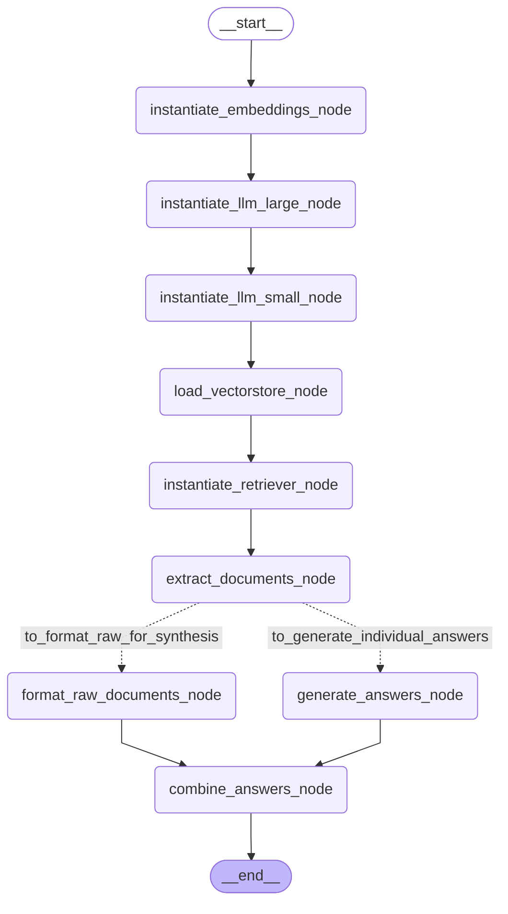

```mermaid
---
config:
  flowchart:
    curve: linear
---
graph TD;
	__start__([<p>__start__</p>]):::first
	instantiate_embeddings_node(instantiate_embeddings_node)
	instantiate_llm_large_node(instantiate_llm_large_node)
	instantiate_llm_small_node(instantiate_llm_small_node)
	load_vectorstore_node(load_vectorstore_node)
	instantiate_retriever_node(instantiate_retriever_node)
	extract_documents_node(extract_documents_node)
	format_raw_documents_node(format_raw_documents_node)
	generate_answers_node(generate_answers_node)
	combine_answers_node(combine_answers_node)
	__end__([<p>__end__</p>]):::last
	__start__ --> instantiate_embeddings_node;
	extract_documents_node -. &nbsp;to_format_raw_for_synthesis&nbsp; .-> format_raw_documents_node;
	extract_documents_node -. &nbsp;to_generate_individual_answers&nbsp; .-> generate_answers_node;
	format_raw_documents_node --> combine_answers_node;
	generate_answers_node --> combine_answers_node;
	instantiate_embeddings_node --> instantiate_llm_large_node;
	instantiate_llm_large_node --> instantiate_llm_small_node;
	instantiate_llm_small_node --> load_vectorstore_node;
	instantiate_retriever_node --> extract_documents_node;
	load_vectorstore_node --> instantiate_retriever_node;
	combine_answers_node --> __end__;
	classDef default fill:#f2f0ff,line-height:1.2
	classDef first fill-opacity:0
	classDef last fill:#bfb6fc

```
